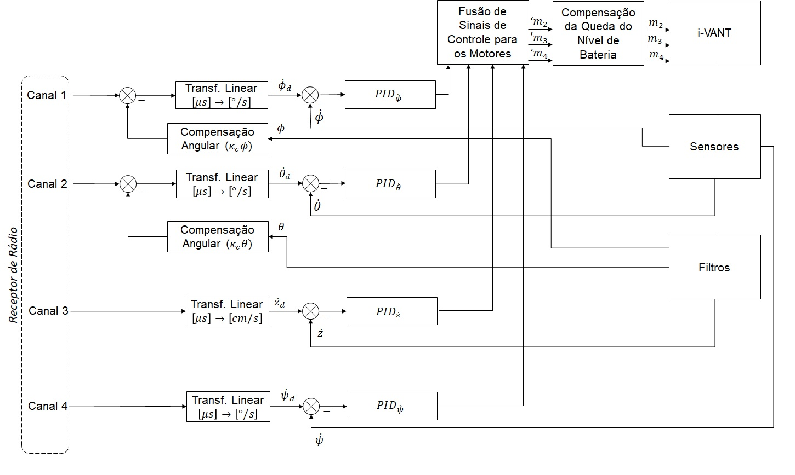

# I-Vant

## Desenvolvimento de um controlador de voo para veículo aéreo não tripulado do tipo quadrirotor.
# Dados gerais
Projeto de pesquisa realizado no IFES <i>Campus</i> Linhares. Coordenado pelo professor Dr. Lucas Vago Santana. 
Início: 2018/2 
Fim: 2019/1 
O propósito do projeto é desenvolver um controlador de voo para Veículos aéreos não tripulados (VANT) do tipo quadrirotor utilizando componentes comerciais de baixo custo. 
Nas imagens abaixo pode-se ver o resultado do projeto, na primeira imagem, o protótipo montato. Na segunda imagem o fluxograma do controlador de voo desenvolvido.
 

# Resultados
<a href="https://www.youtube.com/watch?v=7MADFOaxFZs">Vídeo do experimento</a> 
<a href="http://200.145.27.212/MNR/mostravirtual/interna.php?id=32438">Artigo</a> 

